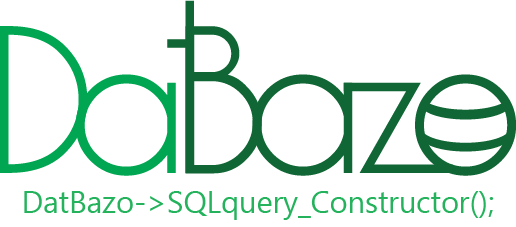

<p align="center">
  
</p>

<p align="right">
  <a href="./README_EO.md"></a>
  <a href="./README_ES.md"></a>
</p>

# DatBazo

DatBazo(Datuma Bazo, Database in Esperanto) is a SQL-query constructor using PDO. is a small library with which you can quickly create queries to the database using the "Prepare" and "Execute" methods of PDO to avoid sql injections.

## Table of contents

1. [Dependencies](#Dependencies)
2. [Install](#Install)
3. [Getting started](#Getting-started)
4. [Methods](#Methods)
5. [Author](#Author)
6. [License](#License)

## Dependencies

This package requires PHP 7 or higher.

## Install

### via composer

```console
composer require kroyxlab/klpdo
```

### Copy repository

Copy the direct repository to your project and require the class.

```php
require_once 'proyect_directory/datbazo/src/DatBazo.php';
use kroyxlab\klpdo\KLPdo as KLPdo;
```

## Getting started

Modify the KLPdo.ini file located in the folder `vendor/kroyxlab/datbazo/src/DBconfig.ini` and modify the values to configure the connection to the database.

```ini
[databazo]
db_driver = Mysql || sqlite3 || pgsql
db_host = Host_name
db_port = Port
db_name = Database_name
db_user = user
db_password = password
db_charset = UTF8
```

If everything is configured correctly, you can start using the library.

```php

require_once "vendor/autoload.php";
use kroyxlab\datbazo\DatBazo as DatBazo;

// instantiate the DatBazo class
$productos = new DatBazo;

// Create an SQL statement using the methods of the KLPdo class
$products->select(['products'=>'name, price'])
          ->where(['price'=>['>=', 12.5]])
          ->order('price')
          ->execute();

// Set the type of fetch you want.
$products->fetch('assoc');

// Use the Method -> render (); to output and format the result of the sql query
$products->render(function($product){

  return "<p>The name of the product is {$product['name']} and the price is {$product['price']}</p>";

});

// Or use a foreach loop using the fetch method

foreach($products->fecth('obj') as $product){
  echo "<p>The name of the product is $product->name and the price is $product->price</p>"
}

```

## Methods

The methods of the DatBazo class help to create an SQL statement which will be executed through the `prepare` and `execute` methods of Pdo to avoid SQL injections.

### **List of methods:**

* [Select()](./docs/en/select.md)
* [join()](./docs/en/join.md)
* [Insert()](./docs/en/insert.md)
* [Where()](./docs/en/where.md)
* [Update()](./docs/en/update.md)
* [Delete()](./docs/en/delete.md)
* [Limit()](./docs/en/limit.md)
* [Offset()](./docs/en/offset.md)
* [Group()](./docs/en/group.md)
* [Order()](./docs/en/order.md)
* [Execute()](./docs/en/execute.md)
* [Fetch()](./docs/en/fetch.md)
* [Render()](./docs/en/render.md)

## **Author**

* **Kristian Soto (KroyxLab)** - [Github](https://github.com/KroyxLab) | [Gitlab](https://gitlab.com/KroyxLab)

## **License**

This project is licensed under the MIT License - see the [MIT.md](license.md) file for details