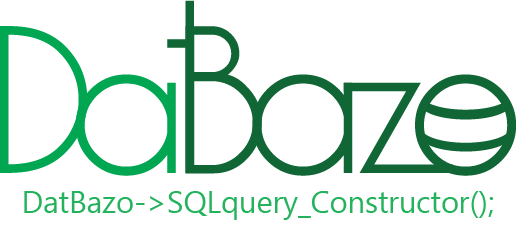

<p align="center">
  
</p>

# DatBazo

DatBazo(Datuma Bazo, Base de datos en Esperanto) es un SQL-query constructor el cual trabaja con PDO. Es un pequeña libreria con la que podras crear consultas a la base de datos usando los metodos "Prepare" y "Execute" de PDO para de esta manera evitar las injecciones sql.

## Indice

1. [Dependencias](#Dependencias)
2. [Instalar](#Instalar)
3. [Para empezar](#Para-empezar)
4. [Métodos](#Métodos)
5. [Autor](#Autor)
6. [Licencia](#Licencia)

## Dependencias

Este paquete requiere de PHP 7 o superior.

## Instalar

### vía composer

```console
composer require kroyxlab/datbazo
```

### Copiando el repositorio

Copia el repositorio directo en tu proyecto y requiere la clase.

```php
require_once 'directorio_del_proyecto/datbazo/src/DatBazo.php';
use kroyxlab\datbazo\DatBazo as DatBazo;
```

## Para empezar

Modifica el archivo DBconfig.ini ubicado en la carpeta `vendor/kroyxlab/datbazo/src/DBconfig.ini` y modifica los valores para configurar la conexión a la base de datos.

```ini
[database]
db_driver = Mysql, sqlite3, pgsql
db_host = Nombre_del_Host
db_port = Puerto
db_name = Nombre_de_la_base_de_datos
db_user = usuario
db_password = contraseña
db_charset = UTF8
```

Si todo esta configurado correctamente podrás comenzar a usar la librería.

```php

require_once "vendor/autoload.php";
use kroyxlab\datbazo\DatBazo as DatBazo;

// instancia la clase DatBazo
$productos = new DatBazo;

// Usa el metodo fetch(); para obtener el resultado de la consulta sql..

$productos->fetch();

// ... y puedes usarlo en un ciclo foreach

foreach($produktoj->fetch() as $produkto){
  echo "
    <tr>
      <td>$produkto['nomo']</td>
      <td>$produkto['prezo']</td>
    </tr>
  ";
}

```

## Métodos

Los metodos de la clase DatBazo ayudan a crear una sentencia SQL la cual sera ejecuta atraves de los metodos `prepare` y `execute` de Pdo evitando asi las injecciones SQL.

### **Lista de metodos:**

* [Select()](./docs/es/select.md)
* [join()](./docs/es/join.md)
* [Insert()](./docs/es/insert.md)
* [Where()](./docs/es/where.md)
* [Update()](./docs/es/update.md)
* [Delete()](./docs/es/delete.md)
* [Limit()](./docs/es/limit.md)
* [Offset()](./docs/es/offset.md)
* [Group()](./docs/es/group.md)
* [Order()](./docs/es/order.md)
* [Execute()](./docs/es/execute.md)
* [Fetch()](./docs/es/fetch.md)
* [Render()](./docs/es/render.md)

## **Autor**

* **Kristian Soto (KroyxLab)** - [Github](https://github.com/KroyxLab) | [Gitlab](https://gitlab.com/KroyxLab)

## **Licencia**

This project is licensed under the MIT License - see the [MIT.md](license.md) file for details